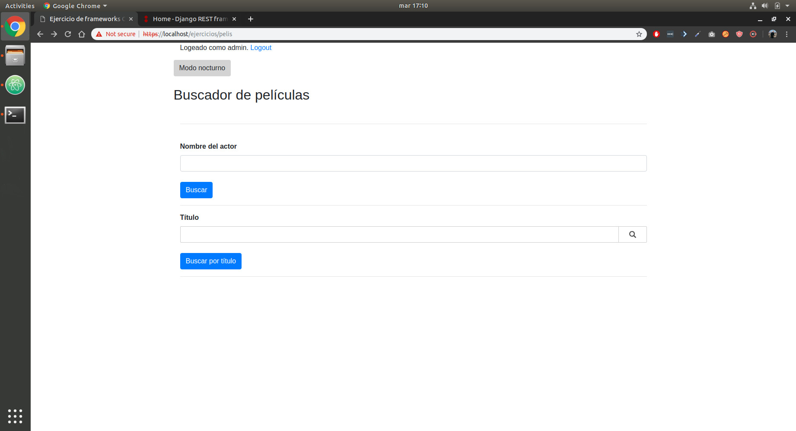
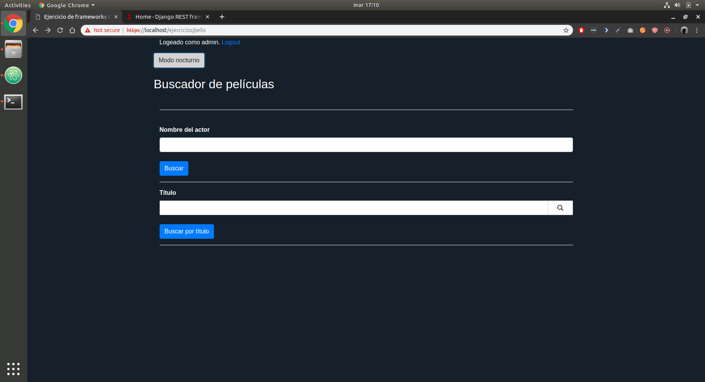
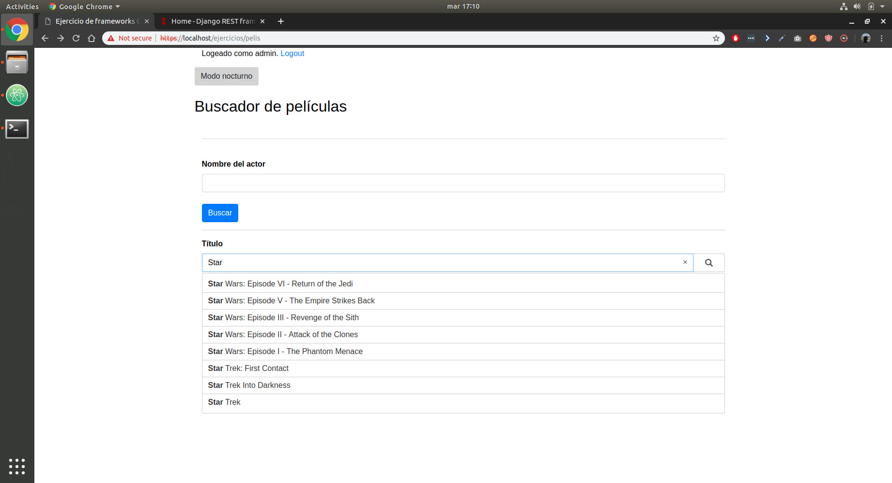
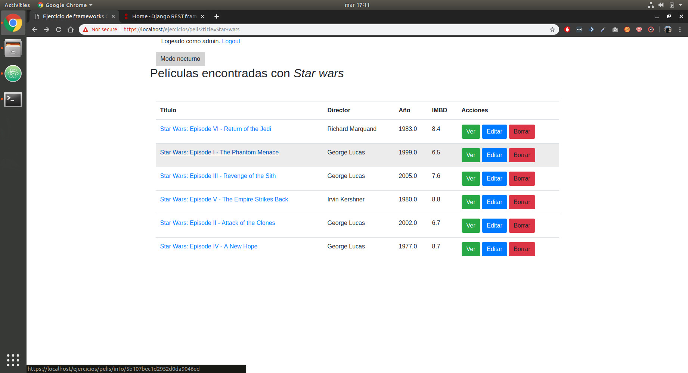
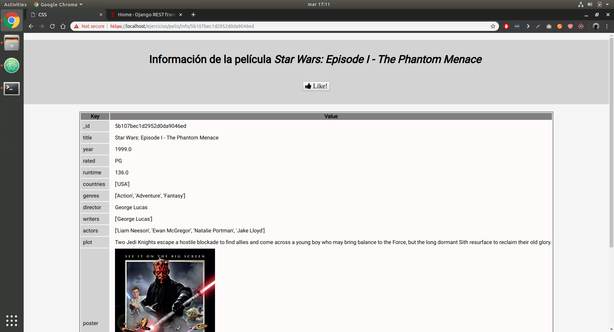

# Docker-Compose + Django + MongoDB toy project

Movie management app that allows people to log in as system users, change theme color, search for movies using a typeahead JS library and like, edit and delete them if they have the appropriate permissions.

Other technologies used: Docker compose, MongoDB, HTTPS, NGINX, Jinja templates, django forms, allauth, jQuey, AJAX, django CRSF, Django logger, expresiones regulares, mongoengine, Bootstap, API REST CRUD,

For setting up and launching the project, download this repository and execute

* `sudo make build`
* `sudo make import-data`
* `sudo make migrate`
* `sudo make`

## Screenshoots

