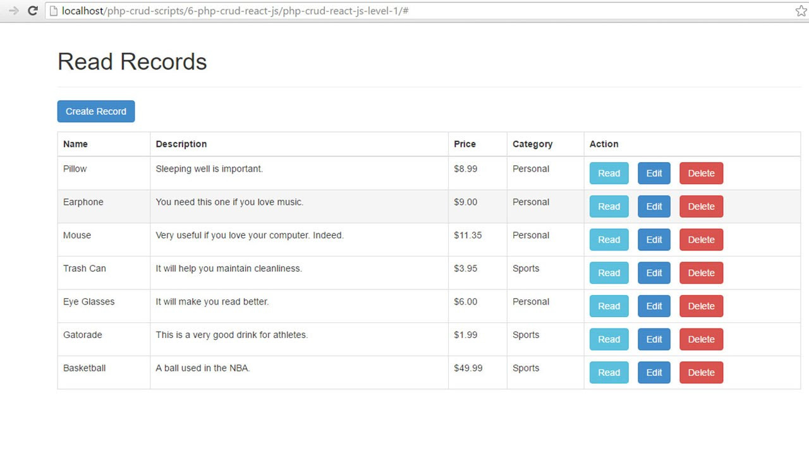

# CRUD

Es esta tarea haremos las pantallas para el resto del CRUD de la aplicación, usando la clase forms de Django. Aqui hay un ejemplo.

Sugerencia: Usar django-mongoengine-forms para conenctar directamente con la BD

* https://docs.djangoproject.com/en/2.1/topics/forms/
* https://medium.com/@siddharthshringi/how-i-made-my-first-django-app-4ede65c9b17f
* https://pypi.org/project/django-mongoengine-forms/
